# BlocklyPy Commander - Architecture Overview

## Table of Contents

1. [Introduction](#introduction)
2. [High-Level Architecture](#high-level-architecture)
3. [Core Components](#core-components)
4. [Communication Layer](#communication-layer)
5. [Debug Tunnel Architecture](#debug-tunnel-architecture)
6. [View System](#view-system)
7. [Data Flow](#data-flow)
8. [Extension Lifecycle](#extension-lifecycle)
9. [Technology Stack](#technology-stack)

---

## Introduction

BlocklyPy Commander is a Visual Studio Code extension that provides
comprehensive support for LEGO robotics development. It enables developers to
connect to LEGO Hubs (Pybricks and HubOS v3), write Python code, debug programs,
visualize sensor data, and convert between different LEGO programming formats.

### Key Capabilities

- Multi-protocol hub connectivity (Bluetooth & USB)
- Real-time debugging with breakpoints
- Live data visualization and plotting
- File format conversion (SPIKE, EV3, WeDo 2.0, Pybricks)
- Interactive REPL sessions
- Jupyter notebook support

---

## High-Level Architecture

The extension follows a layered architecture pattern with clear separation of
concerns:

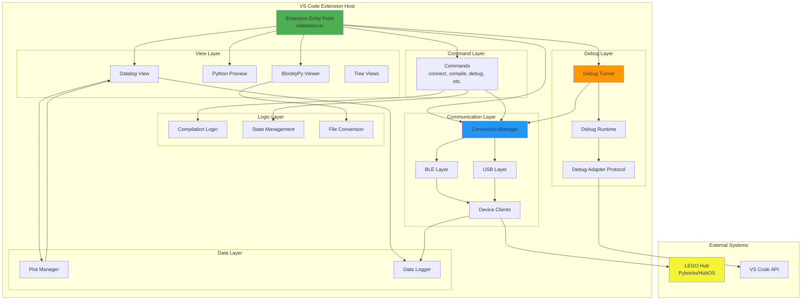
```mermaid
graph TB
    subgraph "VS Code Extension Host"
        EXT[Extension Entry Point<br/>extension.ts]

        subgraph "Command Layer"
            CMD[Commands<br/>connect, compile, debug, etc.]
        end

        subgraph "View Layer"
            VIEW1[BlocklyPy Viewer]
            VIEW2[Python Preview]
            VIEW3[Datalog View]
            VIEW4[Tree Views]
        end

        subgraph "Logic Layer"
            LOGIC1[Compilation Logic]
            LOGIC2[State Management]
            LOGIC3[File Conversion]
        end

        subgraph "Communication Layer"
            CONN[Connection Manager]
            BLE[BLE Layer]
            USB[USB Layer]
            CLIENT[Device Clients]
        end

        subgraph "Debug Layer"
            DEBUG[Debug Tunnel]
            RUNTIME[Debug Runtime]
            DAP[Debug Adapter Protocol]
        end

        subgraph "Data Layer"
            PLOT[Plot Manager]
            DATALOG[Data Logger]
        end
    end

    subgraph "External Systems"
        HUB[LEGO Hub<br/>Pybricks/HubOS]
        VSCODE[VS Code API]
    end

    EXT --> CMD
    EXT --> VIEW1
    EXT --> VIEW2
    EXT --> VIEW3
    EXT --> CONN
    EXT --> DEBUG

    CMD --> LOGIC1
    CMD --> LOGIC2
    CMD --> CONN

    VIEW1 --> LOGIC3
    VIEW3 --> PLOT
    VIEW3 --> DATALOG

    CONN --> BLE
    CONN --> USB
    BLE --> CLIENT
    USB --> CLIENT
    CLIENT --> HUB

    DEBUG --> RUNTIME
    DEBUG --> CONN
    RUNTIME --> DAP
    DAP --> VSCODE

    PLOT --> VIEW3
    CLIENT --> DATALOG

    style EXT fill:#4CAF50
    style CONN fill:#2196F3
    style DEBUG fill:#FF9800
    style HUB fill:#F4F436
```

---

## Core Components

### 1. Extension Entry Point (`extension.ts`)

The main entry point orchestrates initialization and cleanup:

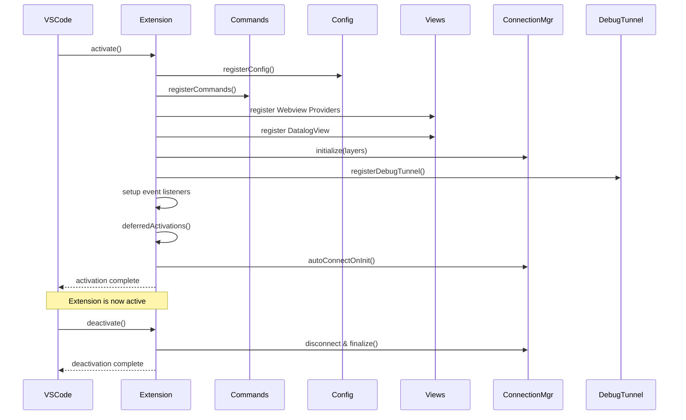
```mermaid
sequenceDiagram
    participant VSCode
    participant Extension
    participant Commands
    participant Config
    participant Views
    participant ConnectionMgr
    participant DebugTunnel

    VSCode->>Extension: activate()
    Extension->>Config: registerConfig()
    Extension->>Commands: registerCommands()
    Extension->>Views: register Webview Providers
    Extension->>Views: register DatalogView
    Extension->>ConnectionMgr: initialize(layers)
    Extension->>DebugTunnel: registerDebugTunnel()
    Extension->>Extension: setup event listeners
    Extension->>Extension: deferredActivations()
    Extension->>ConnectionMgr: autoConnectOnInit()
    Extension-->>VSCode: activation complete

    Note over VSCode,Extension: Extension is now active

    VSCode->>Extension: deactivate()
    Extension->>ConnectionMgr: disconnect & finalize()
    Extension-->>VSCode: deactivation complete
```

**Key Responsibilities:**

- Initialize all subsystems
- Register commands, views, and providers
- Setup event listeners (file saves, document changes, window state)
- Handle auto-start on file save with magic headers
- Manage extension lifecycle

### 2. Command System

Commands provide the user-facing functionality:

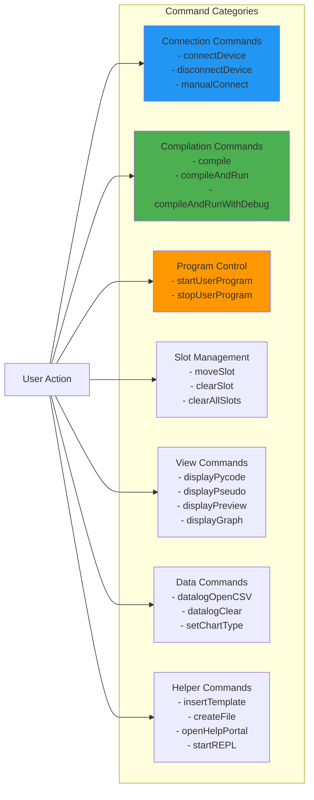
```mermaid
graph LR
    subgraph "Command Categories"
        CONNECT[Connection Commands<br/>- connectDevice<br/>- disconnectDevice<br/>- manualConnect]
        COMPILE[Compilation Commands<br/>- compile<br/>- compileAndRun<br/>- compileAndRunWithDebug]
        PROGRAM[Program Control<br/>- startUserProgram<br/>- stopUserProgram]
        SLOT[Slot Management<br/>- moveSlot<br/>- clearSlot<br/>- clearAllSlots]
        VIEW[View Commands<br/>- displayPycode<br/>- displayPseudo<br/>- displayPreview<br/>- displayGraph]
        DATA[Data Commands<br/>- datalogOpenCSV<br/>- datalogClear<br/>- setChartType]
        HELP[Helper Commands<br/>- insertTemplate<br/>- createFile<br/>- openHelpPortal<br/>- startREPL]
    end

    USER[User Action] --> CONNECT
    USER --> COMPILE
    USER --> PROGRAM
    USER --> SLOT
    USER --> VIEW
    USER --> DATA
    USER --> HELP

    style CONNECT fill:#2196F3
    style COMPILE fill:#4CAF50
    style PROGRAM fill:#FF9800
```

### 3. State Management

Global application state is managed through a centralized state system:

```typescript
enum StateProp {
  Connected, // Device connection status
  Connecting, // Connection in progress
  Scanning, // Scanning for devices
  Running, // Program running on device
  Compiling, // Compilation in progress
}
```

**State Change Flow:**

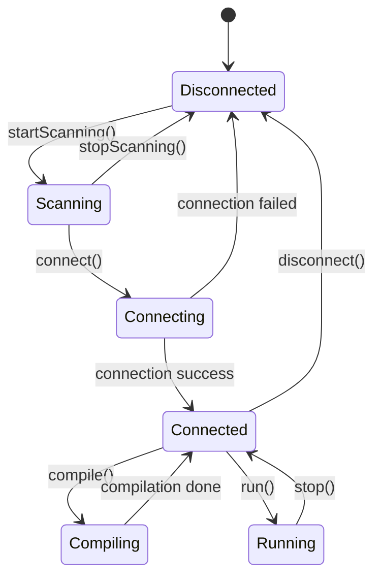
```mermaid
stateDiagram-v2
    [*] --> Disconnected
    Disconnected --> Scanning: startScanning()
    Scanning --> Connecting: connect()
    Scanning --> Disconnected: stopScanning()
    Connecting --> Connected: connection success
    Connecting --> Disconnected: connection failed
    Connected --> Compiling: compile()
    Compiling --> Connected: compilation done
    Connected --> Running: run()
    Running --> Connected: stop()
    Connected --> Disconnected: disconnect()
```

---

## Communication Layer

The communication layer provides an abstraction over different connection types:

### Architecture

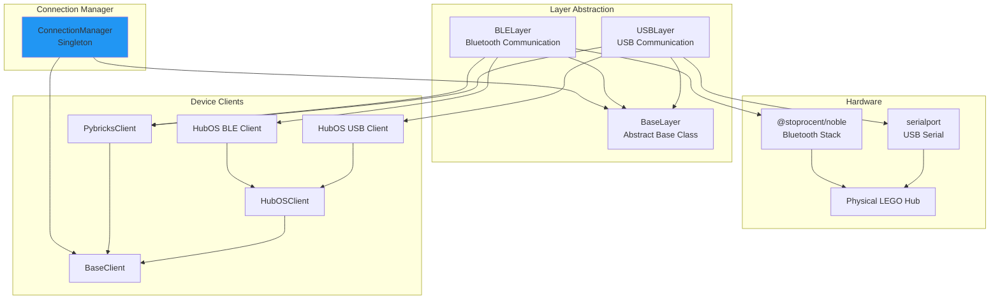
```mermaid
graph TB
    subgraph "Connection Manager"
        MGR[ConnectionManager<br/>Singleton]
    end

    subgraph "Hardware"
        NOBLE["@stoprocent/noble<br/>Bluetooth Stack"]
        SERIALPORT[serialport<br/>USB Serial]
        DEVICE[Physical LEGO Hub]
    end

    subgraph "Layer Abstraction"
        BASELAYER[BaseLayer<br/>Abstract Base Class]
        BLE[BLELayer<br/>Bluetooth Communication]
        USB[USBLayer<br/>USB Communication]
    end

    subgraph "Device Clients"
        BASECLIENT[BaseClient]
        PYBRICKSCLIENT[PybricksClient]
        HUBOSCLIENT[HubOSClient]
        HUBOSBLECLIENT[HubOS BLE Client]
        HUBOSUSBCLIENT[HubOS USB Client]
    end

    MGR --> BASELAYER
    BLE --> BASELAYER
    USB --> BASELAYER

    MGR --> BASECLIENT

    HUBOSBLECLIENT --> HUBOSCLIENT
    HUBOSUSBCLIENT --> HUBOSCLIENT

    PYBRICKSCLIENT --> BASECLIENT
    HUBOSCLIENT --> BASECLIENT


    BLE --> PYBRICKSCLIENT
    BLE --> HUBOSBLECLIENT
    USB --> PYBRICKSCLIENT
    USB --> HUBOSUSBCLIENT

    BLE --> NOBLE
    USB --> SERIALPORT
    NOBLE --> DEVICE
    SERIALPORT --> DEVICE

    style MGR fill:#2196F3
```

### Connection Manager Responsibilities

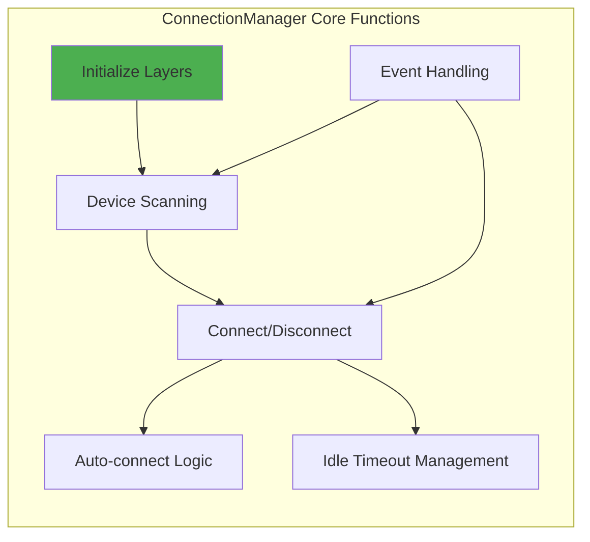
```mermaid
graph LR
    subgraph "ConnectionManager Core Functions"
        INIT[Initialize Layers]
        SCAN[Device Scanning]
        CONN[Connect/Disconnect]
        AUTO[Auto-connect Logic]
        IDLE[Idle Timeout Management]
        EVENT[Event Handling]
    end

    INIT --> SCAN
    SCAN --> CONN
    CONN --> AUTO
    CONN --> IDLE
    EVENT --> SCAN
    EVENT --> CONN

    style INIT fill:#4CAF50
```

**Key Features:**

- **Multi-layer Support**: Manages multiple connection layers (BLE, USB)
- **Device Discovery**: Scans for available LEGO hubs
- **Auto-connect**: Reconnects to last used device
- **Idle Management**: Disconnects after inactivity period
- **Event System**: Publishes device and connection state changes

### Layer Architecture

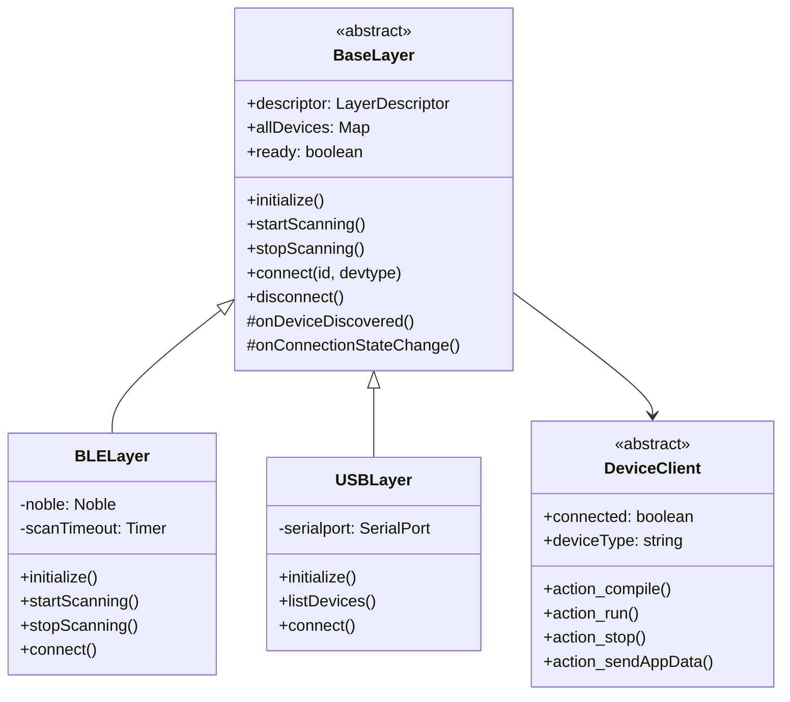
```mermaid
classDiagram
    class BaseLayer {
        <<abstract>>
        +descriptor: LayerDescriptor
        +allDevices: Map
        +ready: boolean
        +initialize()
        +startScanning()
        +stopScanning()
        +connect(id, devtype)
        +disconnect()
        #onDeviceDiscovered()
        #onConnectionStateChange()
    }

    class BLELayer {
        -noble: Noble
        -scanTimeout: Timer
        +initialize()
        +startScanning()
        +stopScanning()
        +connect()
    }

    class USBLayer {
        -serialport: SerialPort
        +initialize()
        +listDevices()
        +connect()
    }

    class DeviceClient {
        <<abstract>>
        +connected: boolean
        +deviceType: string
        +action_compile()
        +action_run()
        +action_stop()
        +action_sendAppData()
    }

    BaseLayer <|-- BLELayer
    BaseLayer <|-- USBLayer
    BaseLayer --> DeviceClient
```

### Connection Flow

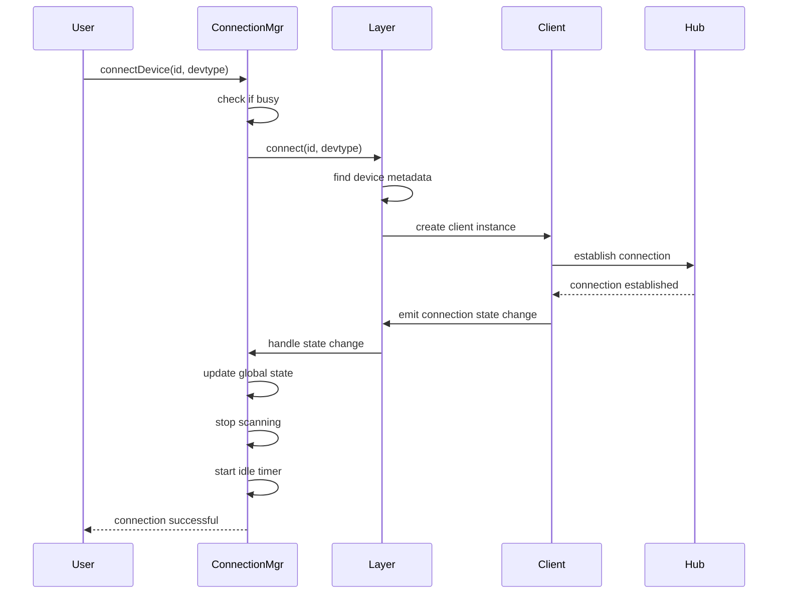
```mermaid
sequenceDiagram
    participant User
    participant ConnectionMgr
    participant Layer
    participant Client
    participant Hub

    User->>ConnectionMgr: connectDevice(id, devtype)
    ConnectionMgr->>ConnectionMgr: check if busy
    ConnectionMgr->>Layer: connect(id, devtype)
    Layer->>Layer: find device metadata
    Layer->>Client: create client instance
    Client->>Hub: establish connection
    Hub-->>Client: connection established
    Client->>Layer: emit connection state change
    Layer->>ConnectionMgr: handle state change
    ConnectionMgr->>ConnectionMgr: update global state
    ConnectionMgr->>ConnectionMgr: stop scanning
    ConnectionMgr->>ConnectionMgr: start idle timer
    ConnectionMgr-->>User: connection successful
```

---

## Debug Tunnel Architecture

The debug tunnel enables VS Code's debugging features for Pybricks devices:

### Component Overview

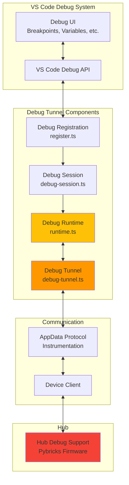
```mermaid
graph TB
    subgraph "VS Code Debug System"
        VSCODE_DEBUG[VS Code Debug API]
        DEBUG_UI[Debug UI<br/>Breakpoints, Variables, etc.]
    end

    subgraph "Debug Tunnel Components"
        REGISTER[Debug Registration<br/>register.ts]
        TUNNEL[Debug Tunnel<br/>debug-tunnel.ts]
        RUNTIME[Debug Runtime<br/>runtime.ts]
        SESSION[Debug Session<br/>debug-session.ts]
    end

    subgraph "Communication"
        APPDATA[AppData Protocol<br/>Instrumentation]
        CLIENT[Device Client]
    end

    subgraph "Hub"
        HUB_DEBUG[Hub Debug Support<br/>Pybricks Firmware]
    end

    VSCODE_DEBUG <--> REGISTER
    DEBUG_UI <--> VSCODE_DEBUG
    REGISTER --> SESSION
    SESSION --> RUNTIME
    RUNTIME <--> TUNNEL
    TUNNEL <--> APPDATA
    APPDATA <--> CLIENT
    CLIENT <--> HUB_DEBUG

    style TUNNEL fill:#FF9800
    style RUNTIME fill:#FFC107
    style HUB_DEBUG fill:#F44336
```

### Debug Session Flow

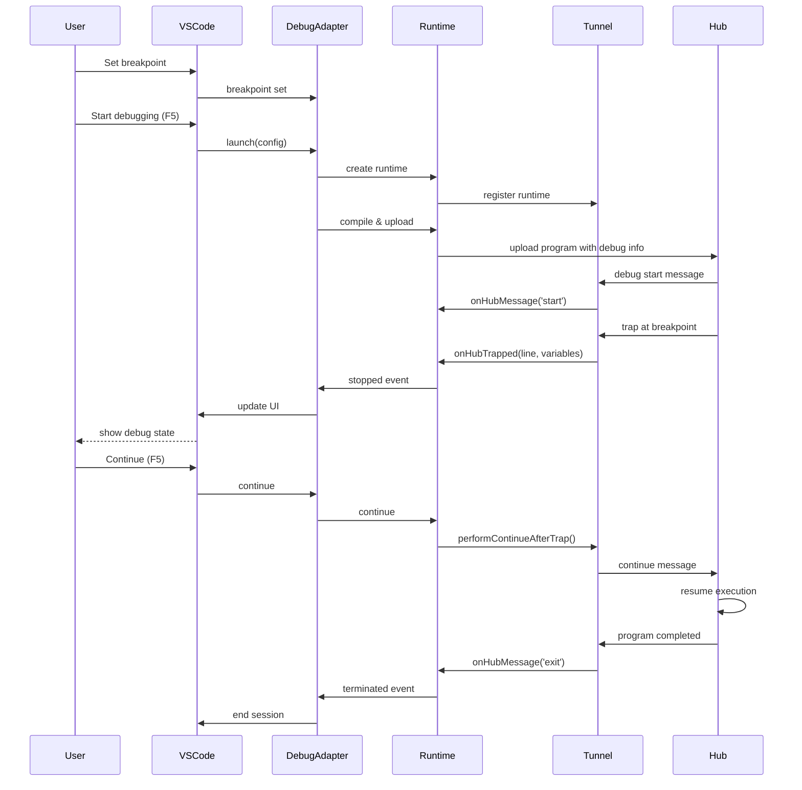
```mermaid
sequenceDiagram
    participant User
    participant VSCode
    participant DebugAdapter
    participant Runtime
    participant Tunnel
    participant Hub

    User->>VSCode: Set breakpoint
    VSCode->>DebugAdapter: breakpoint set

    User->>VSCode: Start debugging (F5)
    VSCode->>DebugAdapter: launch(config)
    DebugAdapter->>Runtime: create runtime
    Runtime->>Tunnel: register runtime

    DebugAdapter->>Runtime: compile & upload
    Runtime->>Hub: upload program with debug info

    Hub->>Tunnel: debug start message
    Tunnel->>Runtime: onHubMessage('start')

    Hub->>Tunnel: trap at breakpoint
    Tunnel->>Runtime: onHubTrapped(line, variables)
    Runtime->>DebugAdapter: stopped event
    DebugAdapter->>VSCode: update UI
    VSCode-->>User: show debug state

    User->>VSCode: Continue (F5)
    VSCode->>DebugAdapter: continue
    DebugAdapter->>Runtime: continue
    Runtime->>Tunnel: performContinueAfterTrap()
    Tunnel->>Hub: continue message
    Hub->>Hub: resume execution

    Hub->>Tunnel: program completed
    Tunnel->>Runtime: onHubMessage('exit')
    Runtime->>DebugAdapter: terminated event
    DebugAdapter->>VSCode: end session
```

### Debug Protocol Messages

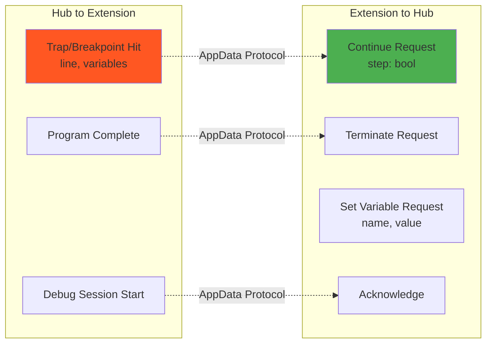
```mermaid
graph LR
    subgraph "Hub to Extension"
        TRAP[Trap/Breakpoint Hit<br/>line, variables]
        START[Debug Session Start]
        COMPLETE[Program Complete]
    end

    subgraph "Extension to Hub"
        CONTINUE[Continue Request<br/>step: bool]
        TERMINATE[Terminate Request]
        SETVAR[Set Variable Request<br/>name, value]
        ACK[Acknowledge]
    end

    TRAP -.->|AppData Protocol| CONTINUE
    START -.->|AppData Protocol| ACK
    COMPLETE -.->|AppData Protocol| TERMINATE

    style TRAP fill:#FF5722
    style CONTINUE fill:#4CAF50
```

**Key Features:**

- **Breakpoint Support**: Set and hit breakpoints in Python code
- **Variable Inspection**: View local variables at breakpoints
- **Step Execution**: Step through code line by line
- **Variable Modification**: Change variable values during debugging
- **Protocol-based**: Uses Pybricks AppData Instrumentation Protocol

### Debug Runtime State Machine

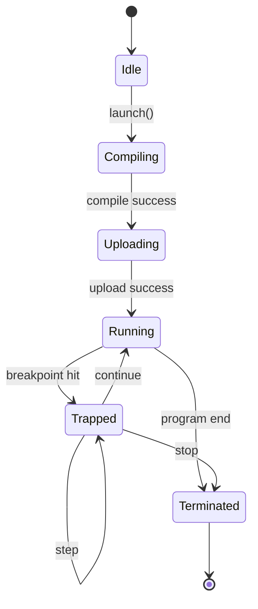
```mermaid
stateDiagram-v2
    [*] --> Idle
    Idle --> Compiling: launch()
    Compiling --> Uploading: compile success
    Uploading --> Running: upload success
    Running --> Trapped: breakpoint hit
    Trapped --> Running: continue
    Trapped --> Trapped: step
    Running --> Terminated: program end
    Trapped --> Terminated: stop
    Terminated --> [*]
```

---

## View System

The extension provides multiple custom views for different purposes:

### View Architecture

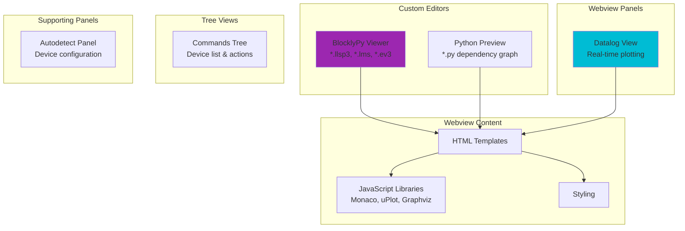
```mermaid
graph TB
    subgraph "Custom Editors"
        BLOCKLYPY[BlocklyPy Viewer<br/>*.llsp3, *.lms, *.ev3]
        PYTHON[Python Preview<br/>*.py dependency graph]
    end

    subgraph "Webview Panels"
        DATALOG[Datalog View<br/>Real-time plotting]
    end

    subgraph "Tree Views"
        CMDTREE[Commands Tree<br/>Device list & actions]
    end

    subgraph "Supporting Panels"
        AUTODETECT[Autodetect Panel<br/>Device configuration]
    end

    subgraph "Webview Content"
        HTML[HTML Templates]
        JS[JavaScript Libraries<br/>Monaco, uPlot, Graphviz]
        CSS[Styling]
    end

    BLOCKLYPY --> HTML
    PYTHON --> HTML
    DATALOG --> HTML

    HTML --> JS
    HTML --> CSS

    style BLOCKLYPY fill:#9C27B0
    style DATALOG fill:#00BCD4
```

### BlocklyPy Viewer

Provides multiple views of LEGO program files:

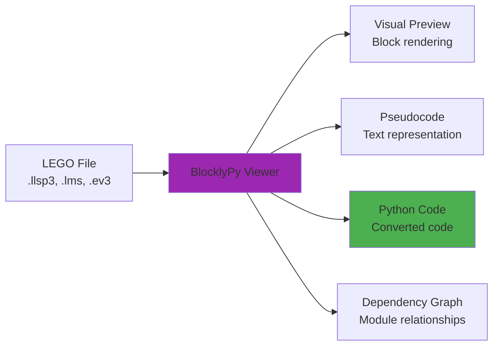
```mermaid
graph LR
    FILE[LEGO File<br/>.llsp3, .lms, .ev3] --> VIEWER[BlocklyPy Viewer]

    VIEWER --> PREVIEW[Visual Preview<br/>Block rendering]
    VIEWER --> PSEUDO[Pseudocode<br/>Text representation]
    VIEWER --> PYCODE[Python Code<br/>Converted code]
    VIEWER --> GRAPH[Dependency Graph<br/>Module relationships]

    style VIEWER fill:#9C27B0
    style PYCODE fill:#4CAF50
```

**Supported File Formats:**

- SPIKE Prime v2 (`.llsp`) and v3 (`.llsp3`)
- Robot Inventor (`.lms`)
- SPIKE Essential (`.lmsp`)
- EV3 Classroom (`.lmsp`), Lab (`.ev3`), iPad (`.ev3m`)
- EV3 Compiled Binary (`.rbf`)
- WeDo 2.0 (`.proj`)

### Datalog View

Real-time data visualization:

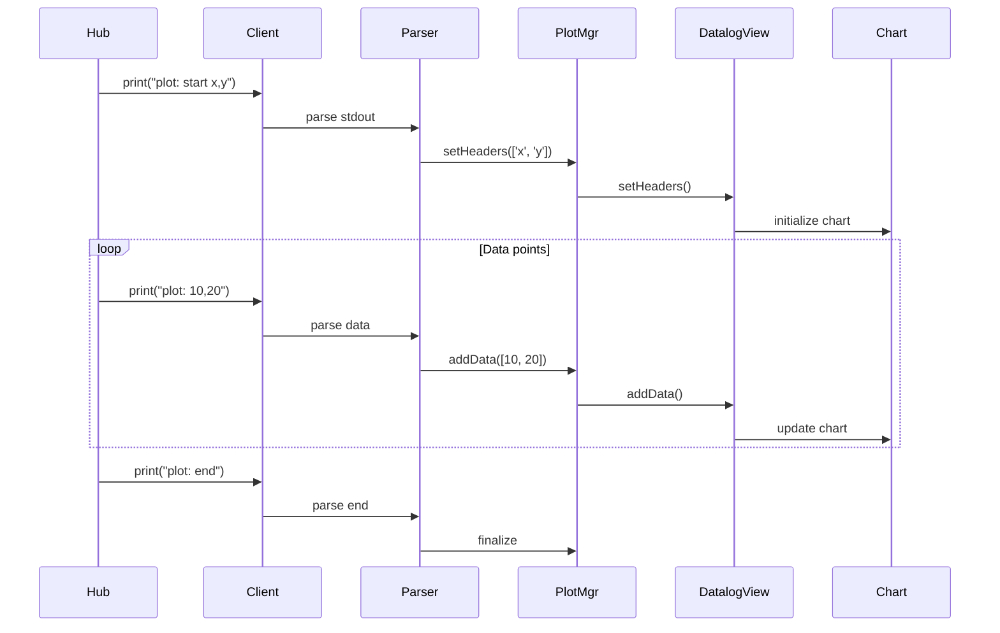
```mermaid
sequenceDiagram
    participant Hub
    participant Client
    participant Parser
    participant PlotMgr
    participant DatalogView
    participant Chart

    Hub->>Client: print("plot: start x,y")
    Client->>Parser: parse stdout
    Parser->>PlotMgr: setHeaders(['x', 'y'])
    PlotMgr->>DatalogView: setHeaders()
    DatalogView->>Chart: initialize chart

    loop Data points
        Hub->>Client: print("plot: 10,20")
        Client->>Parser: parse data
        Parser->>PlotMgr: addData([10, 20])
        PlotMgr->>DatalogView: addData()
        DatalogView->>Chart: update chart
    end

    Hub->>Client: print("plot: end")
    Client->>Parser: parse end
    Parser->>PlotMgr: finalize
```

**Features:**

- Real-time plotting of sensor data
- Multiple chart types (line, bar)
- CSV export functionality
- Device notification filtering
- Automatic data buffering

---

## Data Flow

### Compilation and Execution Flow

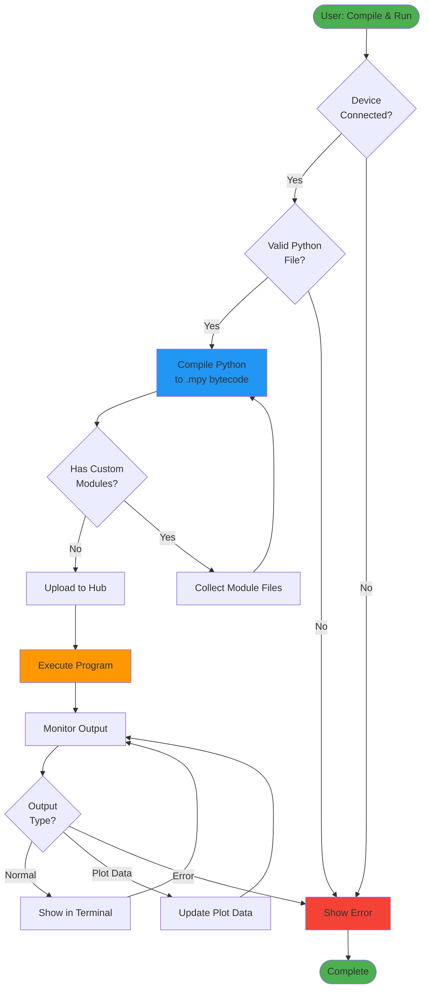
```mermaid
flowchart TB
    START([User: Compile & Run])

    CHECK_CONN{Device<br/>Connected?}
    CHECK_FILE{Valid Python<br/>File?}

    COMPILE[Compile Python<br/>to .mpy bytecode]
    CHECK_MODULES{Has Custom<br/>Modules?}
    COLLECT[Collect Module Files]

    UPLOAD[Upload to Hub]

    RUN[Execute Program]
    MONITOR[Monitor Output]

    PARSE_OUTPUT{Output<br/>Type?}
    PLOT[Update Plot Data]
    ERROR[Show Error]
    PRINT[Show in Terminal]

    END([Complete])

    START --> CHECK_CONN
    CHECK_CONN -->|Yes| CHECK_FILE
    CHECK_CONN -->|No| ERROR
    CHECK_FILE -->|Yes| COMPILE
    CHECK_FILE -->|No| ERROR

    COMPILE --> CHECK_MODULES
    CHECK_MODULES -->|No| UPLOAD
    CHECK_MODULES -->|Yes| COLLECT
    COLLECT --> COMPILE

    UPLOAD --> RUN

    RUN --> MONITOR
    MONITOR --> PARSE_OUTPUT

    PARSE_OUTPUT -->|Normal| PRINT
    PARSE_OUTPUT -->|Plot Data| PLOT
    PARSE_OUTPUT -->|Error| ERROR

    PLOT --> MONITOR
    ERROR --> END
    PRINT --> MONITOR

    style START fill:#4CAF50
    style COMPILE fill:#2196F3
    style RUN fill:#FF9800
    style ERROR fill:#F44336
    style END fill:#4CAF50
```

### Device Communication Flow

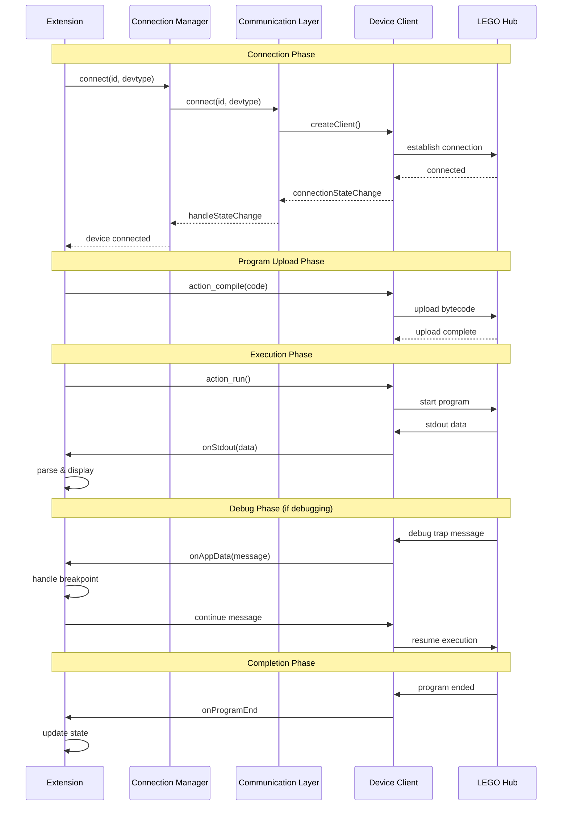
```mermaid
sequenceDiagram
    participant Ext as Extension
    participant ConnMgr as Connection Manager
    participant Layer as Communication Layer
    participant Client as Device Client
    participant Hub as LEGO Hub

    Note over Ext,Hub: Connection Phase
    Ext->>ConnMgr: connect(id, devtype)
    ConnMgr->>Layer: connect(id, devtype)
    Layer->>Client: createClient()
    Client->>Hub: establish connection
    Hub-->>Client: connected
    Client-->>Layer: connectionStateChange
    Layer-->>ConnMgr: handleStateChange
    ConnMgr-->>Ext: device connected

    Note over Ext,Hub: Program Upload Phase
    Ext->>Client: action_compile(code)
    Client->>Hub: upload bytecode
    Hub-->>Client: upload complete

    Note over Ext,Hub: Execution Phase
    Ext->>Client: action_run()
    Client->>Hub: start program
    Hub->>Client: stdout data
    Client->>Ext: onStdout(data)
    Ext->>Ext: parse & display

    Note over Ext,Hub: Debug Phase (if debugging)
    Hub->>Client: debug trap message
    Client->>Ext: onAppData(message)
    Ext->>Ext: handle breakpoint
    Ext->>Client: continue message
    Client->>Hub: resume execution

    Note over Ext,Hub: Completion Phase
    Hub->>Client: program ended
    Client->>Ext: onProgramEnd
    Ext->>Ext: update state
```

### Plot Data Processing

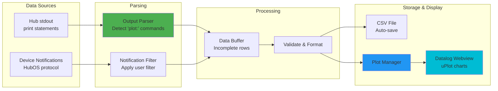
```mermaid
flowchart LR
    subgraph "Data Sources"
        STDOUT[Hub stdout<br/>print statements]
        DEVICE_NOTIF[Device Notifications<br/>HubOS protocol]
    end

    subgraph "Parsing"
        PARSER[Output Parser<br/>Detect 'plot:' commands]
        FILTER[Notification Filter<br/>Apply user filter]
    end

    subgraph "Processing"
        BUFFER[Data Buffer<br/>Incomplete rows]
        VALIDATE[Validate & Format]
    end

    subgraph "Storage & Display"
        CSV[CSV File<br/>Auto-save]
        PLOTMGR[Plot Manager]
        WEBVIEW[Datalog Webview<br/>uPlot charts]
    end

    STDOUT --> PARSER
    DEVICE_NOTIF --> FILTER

    PARSER --> BUFFER
    FILTER --> BUFFER

    BUFFER --> VALIDATE
    VALIDATE --> CSV
    VALIDATE --> PLOTMGR
    PLOTMGR --> WEBVIEW

    style PARSER fill:#4CAF50
    style PLOTMGR fill:#2196F3
    style WEBVIEW fill:#00BCD4
```

**Plot Command Format:**

- `plot: start col1,col2,...` - Initialize columns
- `plot: col1: value1, col2: value2` - Named values
- `plot: value1,value2,...` - Positional values
- `plot: end` - Terminate session

**Plot Column Definitions for `start`:**

Plot columns can include a number of options that modify rendering.

```plain
column_name [axis:<type>|x[time]] [range:min..max]
```


---

## Extension Lifecycle

### Activation Sequence

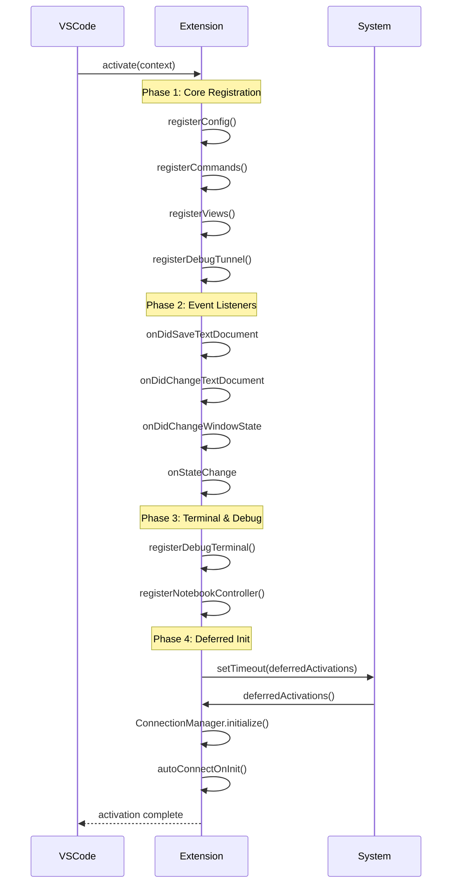
```mermaid
sequenceDiagram
    participant VSCode
    participant Extension
    participant System

    VSCode->>Extension: activate(context)

    Note over Extension: Phase 1: Core Registration
    Extension->>Extension: registerConfig()
    Extension->>Extension: registerCommands()
    Extension->>Extension: registerViews()
    Extension->>Extension: registerDebugTunnel()

    Note over Extension: Phase 2: Event Listeners
    Extension->>Extension: onDidSaveTextDocument
    Extension->>Extension: onDidChangeTextDocument
    Extension->>Extension: onDidChangeWindowState
    Extension->>Extension: onStateChange

    Note over Extension: Phase 3: Terminal & Debug
    Extension->>Extension: registerDebugTerminal()
    Extension->>Extension: registerNotebookController()

    Note over Extension: Phase 4: Deferred Init
    Extension->>System: setTimeout(deferredActivations)
    System->>Extension: deferredActivations()
    Extension->>Extension: ConnectionManager.initialize()
    Extension->>Extension: autoConnectOnInit()

    Extension-->>VSCode: activation complete
```

### Deactivation Sequence

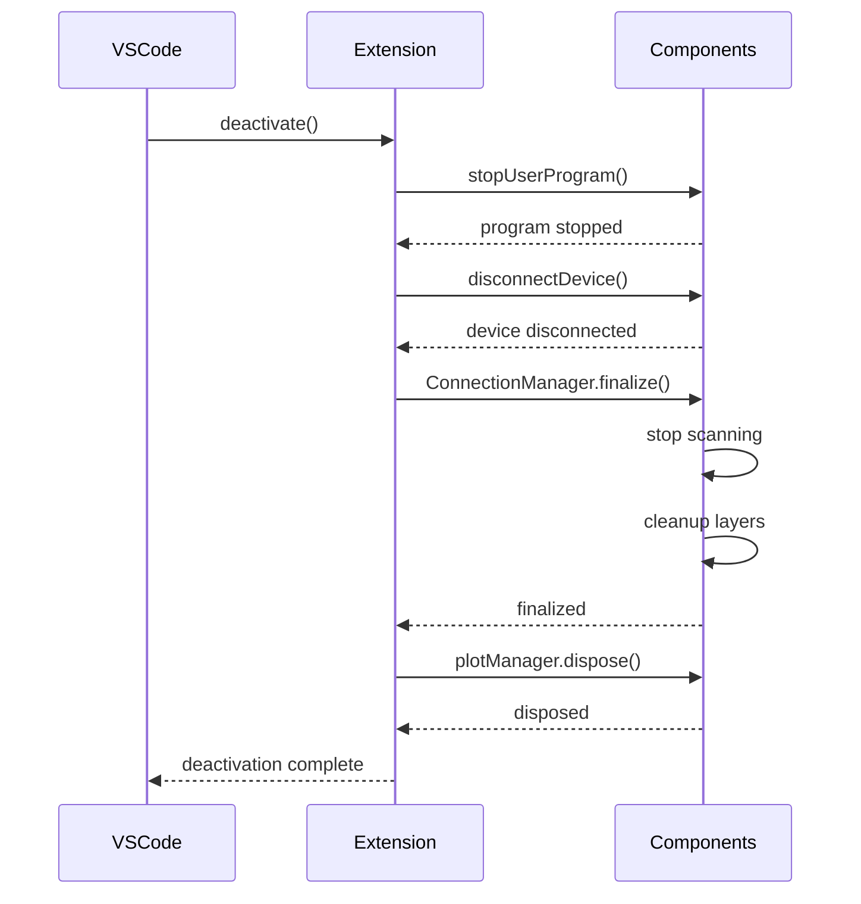
```mermaid
sequenceDiagram
    participant VSCode
    participant Extension
    participant Components

    VSCode->>Extension: deactivate()

    Extension->>Components: stopUserProgram()
    Components-->>Extension: program stopped

    Extension->>Components: disconnectDevice()
    Components-->>Extension: device disconnected

    Extension->>Components: ConnectionManager.finalize()
    Components->>Components: stop scanning
    Components->>Components: cleanup layers
    Components-->>Extension: finalized

    Extension->>Components: plotManager.dispose()
    Components-->>Extension: disposed

    Extension-->>VSCode: deactivation complete
```

---

## Technology Stack

### Core Technologies

```mermaid
graph TB
    subgraph "Runtime"
        NODE[Node.js]
        ELECTRON[Electron<br/>VS Code Host]
    end

    subgraph "Languages"
        TS[TypeScript<br/>Main Language]
        JS[JavaScript<br/>Webview Scripts]
        PY[Python<br/>Target Language]
    end

    subgraph "VS Code APIs"
        EXT_API[Extension API]
        DEBUG_API[Debug Adapter Protocol]
        WEBVIEW_API[Webview API]
        CUSTOM_EDITOR[Custom Editor API]
    end

    subgraph "Communication"
        NOBLE["@stoprocent/noble<br/>Bluetooth"]
        SERIAL[serialport<br/>USB Serial]
        USB[usb<br/>USB Low-level]
    end

    subgraph "Data Processing"
        BLOCKLYPY[blocklypy<br/>File Conversion]
        MPY_CROSS["@pybricks/mpy-cross-v6<br/>Python Compilation"]
        PROG_ANALYSIS["@pybricks/python-program-analysis<br/>Code Analysis"]
    end

    subgraph "Visualization"
        MONACO[Monaco Editor<br/>Code Display]
        UPLOT[uPlot<br/>Charting]
        GRAPHVIZ["@hpcc-js/wasm-graphviz<br/>Graphs"]
        SVG_PAN[svg-pan-zoom<br/>Graph Navigation]
    end

    subgraph "Build Tools"
        WEBPACK[Webpack<br/>Bundler]
        ESLINT[ESLint<br/>Linting]
        JEST[Jest<br/>Testing]
    end

    NODE --> ELECTRON
    ELECTRON --> TS
    TS --> JS

    TS --> EXT_API
    TS --> DEBUG_API
    TS --> WEBVIEW_API
    TS --> CUSTOM_EDITOR

    TS --> NOBLE
    TS --> SERIAL
    TS --> USB

    TS --> BLOCKLYPY
    TS --> MPY_CROSS
    TS --> PROG_ANALYSIS

    JS --> MONACO
    JS --> UPLOT
    JS --> GRAPHVIZ
    JS --> SVG_PAN

    TS --> WEBPACK
    TS --> ESLINT
    TS --> JEST

    style TS fill:#3178C6
    style NODE fill:#339933
    style ELECTRON fill:#47848F
```

### Key Dependencies

| Category          | Library                           | Purpose                                  |
| ----------------- | --------------------------------- | ---------------------------------------- |
| **Communication** | @stoprocent/noble                 | Bluetooth Low Energy (BLE) communication |
|                   | serialport                        | USB serial port communication            |
|                   | usb                               | Low-level USB device access              |
| **Python Tools**  | @pybricks/mpy-cross-v6            | Compile Python to MicroPython bytecode   |
|                   | @pybricks/python-program-analysis | Analyze Python dependencies              |
|                   | blocklypy                         | Convert LEGO file formats                |
| **Visualization** | uplot                             | High-performance charting library        |
|                   | @hpcc-js/wasm-graphviz            | Render dependency graphs                 |
|                   | monaco-editor                     | Code editor component                    |
|                   | svg-pan-zoom                      | Interactive SVG navigation               |
| **Debug**         | @vscode/debugadapter              | Debug Adapter Protocol implementation    |
|                   | await-notify                      | Synchronization primitives               |
| **Utilities**     | lodash                            | Utility functions                        |
|                   | semver                            | Version comparison                       |
|                   | crc-32                            | Checksum calculations                    |

### Build & Development

```mermaid
graph LR
    subgraph "Source"
        TS_SRC[TypeScript Source<br/>src/**/*.ts]
        ASSETS[Assets<br/>icons, libs, templates]
    end

    subgraph "Build Process"
        WEBPACK_BUILD[Webpack<br/>Compilation]
        MONACO_PLUGIN[Monaco Editor<br/>Webpack Plugin]
        COPY_PLUGIN[Copy Webpack Plugin<br/>Assets]
    end

    subgraph "Output"
        DIST[dist/<br/>Bundled Extension]
        SOURCEMAPS[Source Maps]
    end

    subgraph "Quality"
        ESLINT_CHECK[ESLint<br/>Linting]
        JEST_TEST[Jest<br/>Unit Tests]
    end

    TS_SRC --> WEBPACK_BUILD
    ASSETS --> COPY_PLUGIN
    WEBPACK_BUILD --> MONACO_PLUGIN
    WEBPACK_BUILD --> DIST
    WEBPACK_BUILD --> SOURCEMAPS
    COPY_PLUGIN --> DIST

    TS_SRC --> ESLINT_CHECK
    TS_SRC --> JEST_TEST

    style WEBPACK_BUILD fill:#8DD6F9
    style DIST fill:#4CAF50
```

**Build Commands:**

- `npm run compile` - Development build
- `npm run watch` - Watch mode for development
- `npm run package` - Production build
- `npm run lint` - Run linting
- `npm run test` - Run tests

### File Structure

```
blocklypy-vscode/
├── src/                          # Source code
│   ├── extension.ts              # Entry point
│   ├── commands/                 # Command implementations
│   ├── communication/            # Device communication layer
│   │   ├── connection-manager.ts
│   │   ├── layers/               # BLE, USB layers
│   │   └── clients/              # Device-specific clients
│   ├── debug-tunnel/             # Debug support
│   │   ├── debug-tunnel.ts
│   │   ├── runtime.ts
│   │   └── debug-session.ts
│   ├── views/                    # Custom editors & webviews
│   │   ├── BlocklypyViewerProvider.ts
│   │   ├── PythonPreviewProvider.ts
│   │   └── DatalogView.ts
│   ├── logic/                    # Business logic
│   ├── plot/                     # Data plotting
│   ├── pybricks/                 # Pybricks protocol
│   ├── spike/                    # SPIKE protocol
│   ├── extension/                # Extension utilities
│   └── utils/                    # General utilities
├── asset/                        # Static assets
│   ├── icons/                    # SVG icons
│   ├── libs/                     # JavaScript libraries
│   └── python-libs/              # Python helper scripts
├── docs/                         # Documentation
├── prebuilds/                    # Native binary prebuilds
├── patches/                      # npm package patches
├── dist/                         # Compiled output
└── package.json                  # Extension manifest
```

---

## Conclusion

BlocklyPy Commander is a sophisticated VS Code extension built with a modular,
layered architecture. Key architectural highlights include:

1. **Separation of Concerns**: Clear boundaries between UI, business logic, and
   communication layers
2. **Extensibility**: Plugin-based communication layer supports multiple
   protocols
3. **Real-time Capabilities**: Bi-directional communication for debugging and
   data streaming
4. **Multi-format Support**: Comprehensive LEGO file format conversion
5. **Developer Experience**: Rich debugging, visualization, and productivity
   features

The architecture enables rapid development while maintaining code quality and
testability, making it well-suited for the complex requirements of robotics
development tooling.

---

## Appendix: Key Workflows

### Workflow 1: MicroPython Notebook Execution

The extension supports running Jupyter notebook cells directly on connected LEGO
hubs through an interactive REPL session:

#### Component Architecture

```mermaid
graph TB
    subgraph "VS Code Notebook System"
        NOTEBOOK[Jupyter Notebook<br/>.ipynb file]
        KERNEL[Notebook Controller<br/>blocklypy-micropython]
    end

    subgraph "Extension Components"
        EXEC[Cell Execution Handler]
        REPL_MGR[REPL Session Manager]
        OUTPUT[Output Streaming]
    end

    subgraph "Communication"
        CLIENT[Pybricks BLE Client]
        HUB[Connected Hub<br/>REPL Mode]
    end

    NOTEBOOK --> KERNEL
    KERNEL --> EXEC
    EXEC --> REPL_MGR
    REPL_MGR --> CLIENT
    CLIENT --> HUB
    HUB --> OUTPUT
    OUTPUT --> KERNEL
    KERNEL --> NOTEBOOK

    style KERNEL fill:#9C27B0
    style REPL_MGR fill:#FF9800
    style HUB fill:#F44336
```

#### Execution Flow

```mermaid
sequenceDiagram
    participant User
    participant Notebook as Jupyter Notebook
    participant Controller as Notebook Controller
    participant REPL as REPL Manager
    participant Client as BLE Client
    participant Hub as LEGO Hub

    User->>Notebook: Execute cell
    Notebook->>Controller: executeHandler(cells)

    alt REPL not active or new client
        Controller->>Client: action_start(REPL mode)
        Client->>Hub: start REPL session
        Hub-->>Client: REPL ready
        Controller->>REPL: mark REPL active
    end

    Controller->>Controller: create execution
    Controller->>Controller: wrap code with markers
    Note over Controller: print('REPL: start')<br/>user code<br/>print('REPL: end')

    Controller->>Client: sendCodeToRepl(code)
    Client->>Hub: send code line by line

    loop Stream output
        Hub->>Client: stdout chunks
        Client->>Controller: onStdout(chunk)
        Controller->>Controller: parse markers
        alt between start/end markers
            Controller->>Notebook: append output
            Notebook->>User: display output
        end
    end

    Hub->>Client: print 'REPL: end' or '>>>'
    Controller->>Controller: detect completion
    Controller->>Notebook: end execution (success)

    alt User interrupts
        User->>Notebook: Interrupt kernel
        Notebook->>Controller: interruptHandler
        Controller->>Client: send Ctrl-C (\x03)
        Client->>Hub: interrupt execution
    end
```

#### State Management

```mermaid
stateDiagram-v2
    [*] --> NoDevice: Extension starts
    NoDevice --> WaitingForCell: Device connected
    WaitingForCell --> StartingREPL: Cell executed
    StartingREPL --> REPLActive: REPL started
    REPLActive --> ExecutingCode: Send code
    ExecutingCode --> StreamingOutput: Code sent
    StreamingOutput --> REPLActive: Execution complete
    REPLActive --> WaitingForCell: Idle

    REPLActive --> Interrupted: User interrupts
    ExecutingCode --> Interrupted: User interrupts
    StreamingOutput --> Interrupted: User interrupts
    Interrupted --> REPLActive: Resume

    REPLActive --> NoDevice: Device disconnected
    ExecutingCode --> NoDevice: Device disconnected
    StreamingOutput --> NoDevice: Device disconnected
    NoDevice --> [*]: Extension deactivates
```

**Key Features:**

- **Persistent REPL Session**: REPL stays active between cell executions for the
  same client
- **Output Streaming**: Real-time output display as code executes
- **Interrupt Support**: Ctrl-C to interrupt running code
- **Session Recovery**: Automatically detects disconnections and resets state
- **Execution Ordering**: Supports execution order tracking in notebooks

**Output Parsing:**

- Uses marker pattern (`REPL: start` / `REPL: end`) to delimit cell output
- Filters out markers from displayed output
- Handles incomplete output gracefully
- Detects REPL prompt (`>>>`) as alternative completion indicator

---

### Workflow 2: Template Detection and Generation

The extension provides intelligent template generation with automatic device
detection:

#### Architecture Overview

```mermaid
graph TB
    subgraph "User Interaction"
        CMD[Insert Template Command]
        QUICKPICK[Hub Type Quick Pick]
    end

    subgraph "Detection System"
        AUTODETECT[Read device ports]
        DETECT_MOTOR[Motor Pair Detection]
        DETECT_HUB[Device Hub Recognition]
        DETECT_DEVICES[Device Type Recognition]
    end

    subgraph "UI Components"
        WEBVIEW[Autodetect Panel<br/>Robot Sizing Dialog]
        PREVIEW[Live Template Preview]
    end

    subgraph "Template Generation"
        CONTEXT[Template Context<br/>Git author, date, etc.]
        GENERATOR[Code Generator<br/>Device init code]
        ENHANCE[Template Enhancer<br/>Add headers, examples]
    end

    subgraph "Connected Hub"
        HUB[LEGO Hub]
        REPL[REPL Interface]
    end

    CMD --> DETECT_HUB
    DETECT_HUB --> HUB
    DETECT_HUB -.->|No device/manual| QUICKPICK
    DETECT_HUB --> CONTEXT
    QUICKPICK --> CONTEXT

    DETECT_HUB --> AUTODETECT
    AUTODETECT --> REPL
    AUTODETECT --> DETECT_DEVICES
    DETECT_DEVICES --> DETECT_MOTOR
    DETECT_DEVICES --> CONTEXT

    DETECT_MOTOR --> |Suitable motor pair| WEBVIEW
    DETECT_MOTOR -.-> |No motor pair| CONTEXT
    WEBVIEW --> CONTEXT

    CONTEXT --> ENHANCE
    ENHANCE --> GENERATOR
    GENERATOR --> PREVIEW

    style AUTODETECT fill:#4CAF50
    style WEBVIEW fill:#9C27B0
    style GENERATOR fill:#2196F3
```

#### Complete Detection Flow

The hub-autodetect.py script implements device detection for LEGO Powered Up
hubs:

**Detection Algorithm:**

1. **Initialize**

   - Import `ThisHub`, `PUPDevice`, and `Port` from pybricks
   - Create empty `detect` list to store results
   - Initialize `hub = ThisHub`

2. **Port Iteration**

   - Use `dir(Port)` to enumerate all port attributes (A, B, C, D, E, F)
   - For each port constant in the Port class:

3. **Device Query (per port)**

   ```python
   for pc in dir(Port):
     try:
       port = getattr(Port, pc)              # Get port object
       device_id = PUPDevice(port).info()['id']  # Query device type ID
       detect.append([pc, device_id])        # Store [port_name, id]
     except:
       detect.append([pc, 0])                # No device or error: ID = 0
   ```

4. **Output Results**
   - Print format: `AUTODETECT [[port1, id1], [port2, id2], ...]`
   - Device ID of 0 indicates no device connected
   - Non-zero IDs identify specific sensor/motor types

**Key Characteristics:**

- Handles all ports dynamically through Python reflection
- Silent exception handling treats errors as "no device"
- Returns structured list suitable for parsing by the extension
- Executes on the hub itself via REPL interface

```mermaid
sequenceDiagram
    participant User
    participant Command as Template Command
    participant Autodetect as Detection Logic
    participant Hub as Connected Hub
    participant REPL as REPL Session
    participant UI as Autodetect Panel
    participant Generator as Code Generator
    participant Editor as VS Code Editor

    User->>Command: Insert template
    Command->>Editor: show progress notification
    Command->>Generator: updateCode(undefined, inProgress)
    Generator->>Editor: insert initial template

    alt Device Connected
        Command->>Autodetect: autodetectPybricksHub()

        Autodetect->>Hub: check connection
        Hub-->>Autodetect: hub type detected
        Generator->>Editor: update with hub type

        loop For each port A-F
            Autodetect->>REPL: start hub-autodetect.py
            REPL->>Hub: send port query command
            Hub-->>REPL: device type string
            REPL-->>Autodetect: parse device type
            Autodetect->>Autodetect: classify device
            Autodetect->>Generator: updateCode(hubType, devices)
            Generator->>Editor: update template (live)
        end

        Autodetect->>Autodetect: detectMotorPair(devices)

        alt Two motors found
            Autodetect->>UI: show robot sizing panel
            UI->>User: request wheel diameter & axle track
            User->>UI: enter measurements
            UI-->>Autodetect: sizing data
            Autodetect->>Autodetect: generate DriveBase code
        end

        Autodetect->>Generator: updateCode(final)

    else No Device Connected
        Command->>UI: show hub type picker
        UI->>User: select hub type
        User->>UI: choose hub
        UI-->>Command: selected hub type
        Command->>Generator: updateCode(hubType)
    end

    Generator->>Generator: gather context (git, date)
    Generator->>Generator: generate device init code
    Generator->>Generator: add file header
    Generator->>Generator: add example code
    Generator->>Editor: final template
    Editor->>User: show complete template
```

#### Robot Sizing Dialog

```mermaid
graph TB
    subgraph "Autodetect Panel (Webview)"
        DEVICES[Device List Table<br/>Port & Description]
        IMAGE[Robot Sizing Image<br/>Visual guide]
        WHEEL[Wheel Diameter Input<br/>with unit conversion]
        AXLE[Axle Track Input<br/>with unit conversion]
        VALIDATE[Real-time Validation<br/>mm, cm, studs]
        SUBMIT[OK / Cancel Buttons]
    end

    subgraph "Validation Logic"
        PARSE[Parse input string]
        CONVERT[Convert to mm]
        CHECK{Valid?}
        DISPLAY[Update display message]
    end

    WHEEL --> PARSE
    AXLE --> PARSE
    PARSE --> CONVERT
    CONVERT --> CHECK
    CHECK -->|Valid| DISPLAY
    CHECK -->|Invalid| DISPLAY
    DISPLAY --> WHEEL
    DISPLAY --> AXLE

    SUBMIT --> VALIDATE

    style DEVICES fill:#E3F2FD
    style IMAGE fill:#FFF3E0
    style VALIDATE fill:#4CAF50
```

**Supported Measurement Units:**

- **Millimeters (mm)**: `56mm`, `56`, `56.5`
- **Centimeters (cm)**: `5.6cm`, `5.6 cm`
- **LEGO Studs**: `7 studs`, `7s`, `7 stud`
- **Conversion**: 1 stud = 8mm

**Key Features:**

1. **Automatic Device Detection**

   - Queries each port (A-F) via REPL
   - Identifies motors, sensors, and their types
   - Stores port assignments and directions

2. **Live Template Updates**

   - Template updates as devices are detected
   - Shows "in progress" indicator during detection
   - Immediate visual feedback

3. **Motor Pair Detection**

   - Automatically detects two-motor drivebase configuration
   - Shows robot sizing dialog for physical measurements
   - Generates complete DriveBase initialization code

4. **Template Enhancements**

   - Git author detection (from repository)
   - Date and project metadata
   - Connected device information
   - Example code snippets for DriveBase

5. **Fallback Mechanisms**
   - Manual hub type selection if no device connected
   - Skip sizing if motor pair not found
   - Graceful handling of REPL errors

**Generated Template Structure:**

```python
"""
filename.py

Author: [Git author]
Date: [YYYY-MM-DD]
Project: [Workspace name]
Hub: [Connected device, Hub type]
"""

from pybricks.hubs import PrimeHub
from pybricks.pupdevices import Motor, ColorSensor, ...
from pybricks.parameters import Button, Color, ...
from pybricks.robotics import DriveBase
from pybricks.tools import wait, StopWatch

hub = PrimeHub()                                    # Technic Large Hub
left_motor = Motor(Port.A, Direction.COUNTERCLOCKWISE)  # Motor on port A
right_motor = Motor(Port.B)                         # Motor on port B
robot = DriveBase(left_motor, right_motor, 56, 112) # Wheel diameter: 56mm, Axle track: 112mm

# Example commands, uncomment and run to test:
# robot.straight(100)          # Move robot forward for 10 cm / 100 mm
# robot.turn(90)               # Make robot turn 90 degrees
```

---

### Workflow 3: Connect and Run Program

```mermaid
sequenceDiagram
    actor User
    participant UI as VS Code UI
    participant Cmd as Commands
    participant Conn as Connection Manager
    participant Hub as LEGO Hub

    User->>UI: Click "Connect Device"
    UI->>Cmd: connectDevice()
    Cmd->>Conn: startScanning()
    Conn->>Hub: scan for devices
    Hub-->>Conn: device found
    Conn-->>UI: show device list
    User->>UI: select device
    UI->>Cmd: connect(id)
    Cmd->>Conn: connect(id)
    Conn->>Hub: establish connection
    Hub-->>Conn: connected
    Conn-->>UI: update status

    User->>UI: Press F5 (Run)
    UI->>Cmd: compileAndRun()
    Cmd->>Cmd: compile Python
    Cmd->>Hub: upload bytecode
    Hub-->>Cmd: upload complete
    Cmd->>Hub: run program
    Hub->>UI: output stream
    UI->>User: show output
```

### Workflow 4: Debug Session

```mermaid
sequenceDiagram
    actor Developer
    participant VSCode
    participant Debug as Debug Adapter
    participant Hub

    Developer->>VSCode: Set breakpoints
    Developer->>VSCode: Start Debug (Ctrl+F5)
    VSCode->>Debug: launch debug session
    Debug->>Hub: upload with debug info
    Hub->>Debug: program started

    Note over Hub: Program runs until breakpoint

    Hub->>Debug: trap at line X
    Debug->>VSCode: stopped event
    VSCode->>Developer: show debug state

    Developer->>VSCode: inspect variables
    VSCode->>Debug: request variables
    Debug-->>VSCode: variable values

    Developer->>VSCode: step over (F10)
    VSCode->>Debug: step request
    Debug->>Hub: step command
    Hub->>Debug: stopped at line X+1
    Debug->>VSCode: update state

    Developer->>VSCode: continue (F5)
    VSCode->>Debug: continue request
    Debug->>Hub: continue command

    Note over Hub: Program continues

    Hub->>Debug: program complete
    Debug->>VSCode: terminated event
```

### Workflow 5: File Conversion

```mermaid
flowchart LR
    USER[User Opens<br/>LEGO File]

    DETECT[Detect File Type<br/>.llsp3, .lms, etc.]

    PARSE[Parse File<br/>blocklypy library]

    subgraph "Generate Views"
        PREVIEW[Visual Preview<br/>Block Rendering]
        PSEUDO[Pseudocode<br/>Text Format]
        PYTHON[Python Code<br/>Pybricks Compatible]
        GRAPH[Dependency Graph<br/>Module Relations]
    end

    DISPLAY[Display in<br/>Webview]

    USER --> DETECT
    DETECT --> PARSE
    PARSE --> PREVIEW
    PARSE --> PSEUDO
    PARSE --> PYTHON
    PARSE --> GRAPH
    PREVIEW --> DISPLAY
    PSEUDO --> DISPLAY
    PYTHON --> DISPLAY
    GRAPH --> DISPLAY

    style USER fill:#4CAF50
    style PARSE fill:#2196F3
    style DISPLAY fill:#9C27B0
```

---

## Pybricks Pip Package Installation Prompt

A consent-based workflow guides users to install or upgrade the 'pybricks' pip package:

- Trigger: First invocation of Create Pybricks File command.
- Check: Uses Python extension API to resolve active interpreter and attempts an import.
- Prompt: Modal information message with Install/Upgrade/Skip.
- Execution: Opens a dedicated terminal and runs: "<pythonPath>" -m pip install --upgrade pybricks.
- Persistence: Global state flag (pybricksInstallPromptShown) prevents repeat prompts unless user resets global state manually.
