# BlocklyPy Commander for LEGO Robots

[](https://marketplace.visualstudio.com/items?itemName=afarago.blocklypy-vscode)
[](LICENSE)

A powerful Visual Studio Code extension designed to supercharge your development
with LEGO® Hubs, supporting both Pybricks and official HubOS v3 firmware.
Seamlessly connect, program, debug, and analyze your LEGO robotics projects
directly from your favorite editor.

## ✨ Key Features

### 🔌 Hub Connectivity & Control

- **Universal Connection:** Connect to your LEGO Hubs (Pybricks, HubOS v3)
  effortlessly via **Bluetooth** or **USB**.
  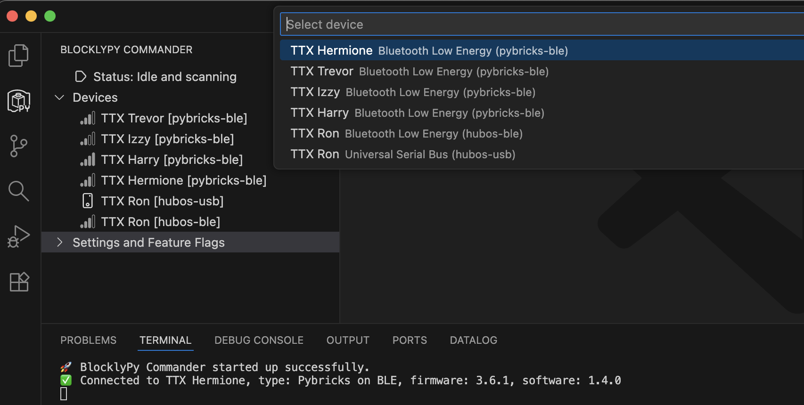
- **Program Lifecycle Management:** **Start and stop** programs on your
  connected hub directly from VS Code.
- **Advanced Slot Management (HubOS):**
  - **Clear Slots:** Erase individual program slots or wipe all slots clean.
  - **Move Slots:** Reorganize your stored programs with ease.
  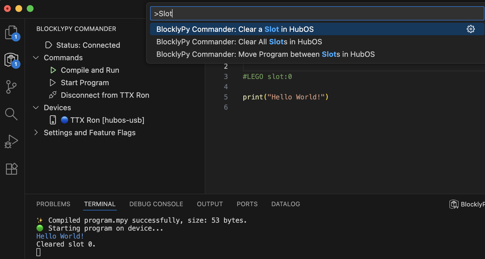
- **Interactive REPL (Pybricks):** Engage in live coding with a Read-Eval-Print
  Loop session for immediate feedback.
  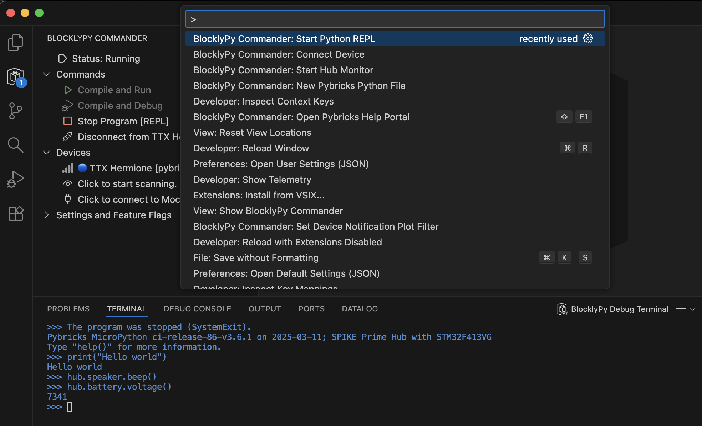
- **Real-time Hub Monitoring:** Get live insights into device activity and
  performance, invaluable for diagnostics and optimization.
- **Smart Connection Features:**
  - **Auto-Connect:** Automatically reconnects to your last-used hub upon
    startup.
  - **Stop Scanning on Window Blur:** A configurable setting to conserve
    resources by pausing Bluetooth scans when VS Code is not in focus.

### 🚀 Code Development & Deployment

- **Effortless Compile & Run:** Write your Python scripts, then compile and
  upload them to your hub with a single command, followed by automatic
  execution.
- **Integrated Debugging:** Unlock the power of VS Code's debugger for your
  Pybricks projects. Set breakpoints, step through code, and inspect variables
  to understand and fix issues faster.
  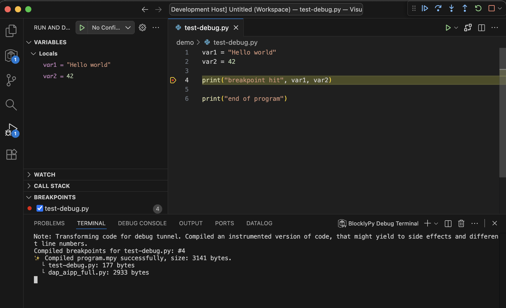
- **MicroPython Notebook Support:** Run and manage `.ipynb` cells directly on
  your connected device, enabling interactive data exploration and code
  execution.
- **Rapid Project Creation with Templates:**
  - **Intelligent Snippets:** Quickly insert common Pybricks code structures
    using snippets like `pybricks`, `primehub`, `inventorhub`.
    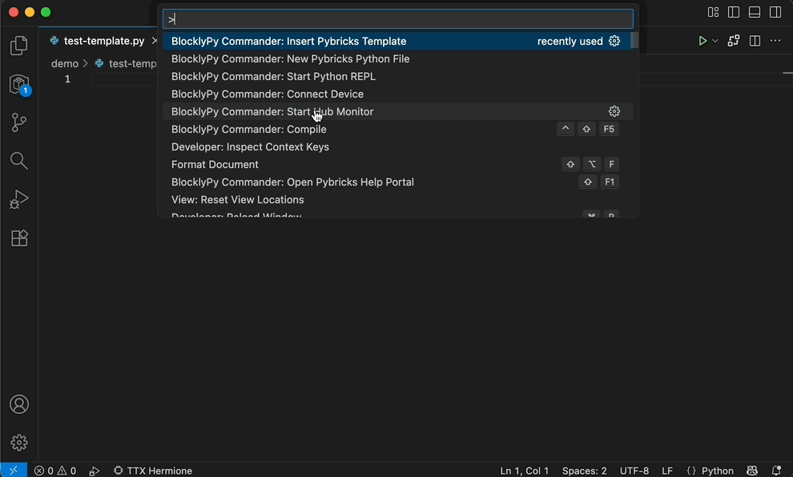
  - **Command Palette Integration:** Use "Insert Pybricks Template" to add
    boilerplate code to your current file or "New Pybricks Python File" to
    create a fresh, templated file.
    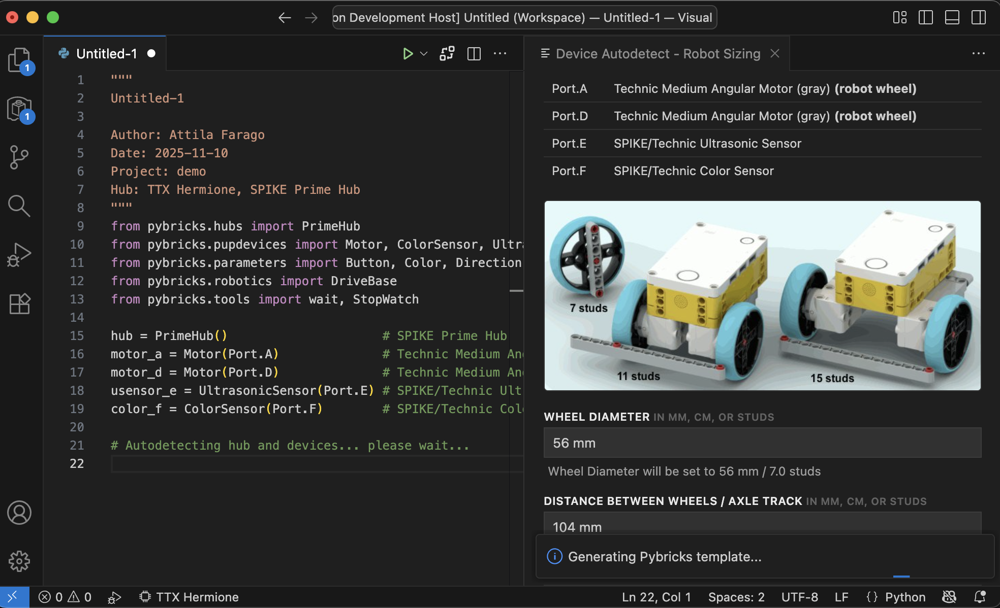
  - Templates come pre-configured with essential imports and auto-detected
    device configurations.
- **Seamless Auto-Start:** Include a magic header comment (e.g.,
  `# LEGO autostart`) in your Python files to automatically upload and run your
  script on the hub every time you save.

### 📊 Monitoring & Diagnostics

- **Real-time Datalogging & Plotting:** Visualize live sensor data and program
  outputs from your hub.
  
  - **Dynamic Charts:** Plot data in real-time by parsing special `plot:`
    commands from your device's standard output.
  - **CSV Export:** Automatically save incoming sensor data to a `.csv` file for
    later analysis.
- **Granular Device Notification Filtering:** Filter and plot specific device
  notifications, offering deep insights for advanced debugging and analysis.
- **Comprehensive Error Reporting:** See detailed compilation and runtime errors
  directly in VS Code, allowing for quick identification and resolution.
  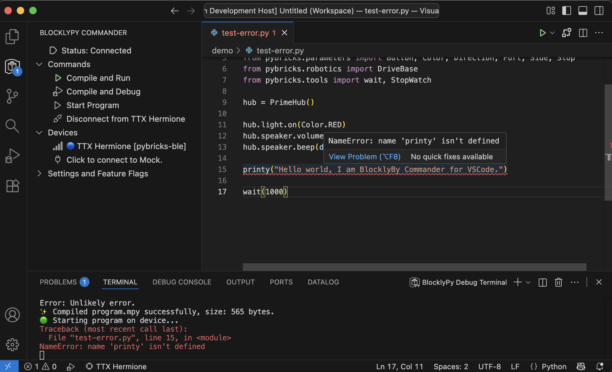
- **Program Status & Output Console:** Receive real-time updates on program
  status and view all messages outputted by your hub in a dedicated console.

### 📂 File Format Support & Analysis

This extension is a versatile tool for opening, displaying, analyzing, and
converting major LEGO robotics file formats, simplifying project onboarding,
backup, and code inspection.

- **Extensive Platform & File Type Support:**
  - **SPIKE Prime / Essentials / Robot Inventor:**
    - SPIKE v2 (`.llsp`) and v3 (`.llsp3`) for both word-blocks and icon-blocks.
    - Robot Inventor (`.lms`).
  - **EV3 Mindstorms:**
    - EV3 Classroom (`.lmsp`), EV3 Lab (`.ev3`), EV3 iPad (`.ev3m`).
    - EV3 Lab Compiled Binary (`.rbf`).
  - **WeDo 2.0:**
    - LEGO WeDo 2.0 project files (`.proj`).
  - **Pybricks:**
    - Pybricks Python (`.py`), with robust multi-file support.
- **Powerful Analysis Tools for LEGO Files:**
  - **Pseudocode Representation:** Transform complex block programs into
    easy-to-read text-based pseudocode.
    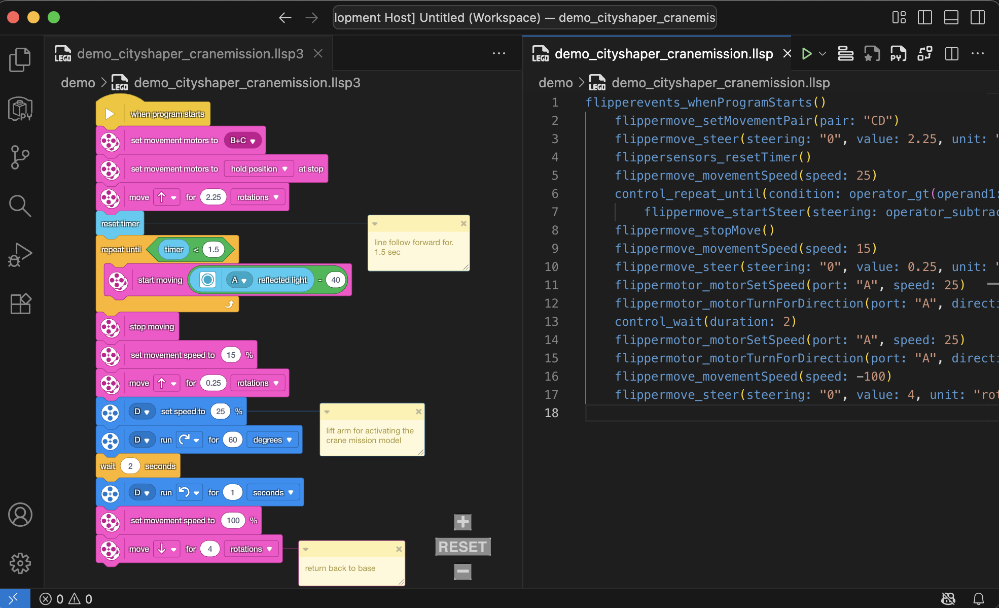
  - **Graphical Preview:** Get an instant visual overview of your block-based
    code.
  - **Module Dependency Visualization:** Understand your code's structure and
    interdependencies with an intuitive graph.
  - **Python Code Conversion:** (Experimental) Convert block code directly into
    compatible Pybricks Python code.
    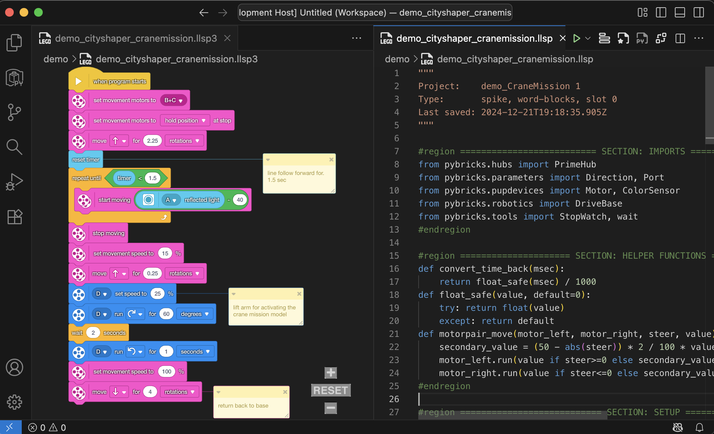
- **Direct Code Views:**
  - **Show Python Code:** View the underlying Python code generated from
    `.llsp3` files.
  - **Show Python Preview:** Render dependency visualization for any Python file
    in a dedicated, side-by-side view.
    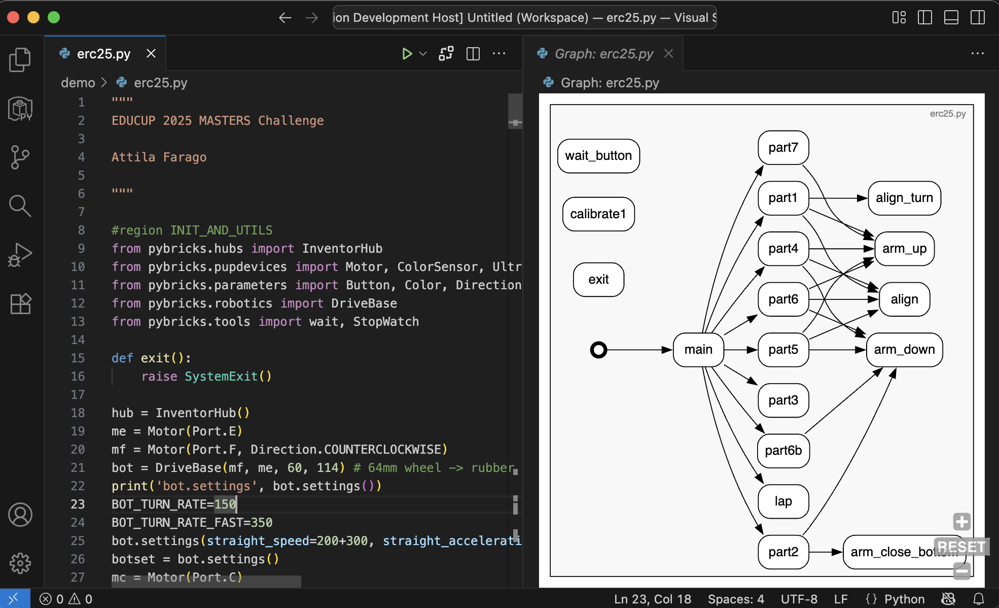

### 🤝 Convenience & Help

- **Configurable Settings:** Easily toggle extension settings and experimental
  feature flags to customize your workflow.
- **Contextual Help Portal:** Access the official Pybricks Help Portal directly.
  The extension intelligently navigates to relevant documentation based on your
  currently selected Python type or keyword.

## 🚀 Getting Started

1.  **Install** the "BlocklyPy Commander" extension from the
    [VS Code Marketplace](https://marketplace.visualstudio.com/items?itemName=afarago.blocklypy-vscode).
2.  **Connect** your LEGO Hub: Simply activate the extension and follow prompts
    to connect via Bluetooth (or USB if supported).
3.  **Create Your First Project:**
    - Open the VS Code Command Palette (`Ctrl+Shift+P`).
    - Search for "New Pybricks Python File" and select your specific hub type to
      generate a new, templated Python script.
    - Alternatively, open any Python file and type `pybricks` (or `primehub`,
      `inventorhub`, etc.) to use a template snippet.
4.  **Run Your Code:** Press `F5` or use the dedicated Run button in the VS Code
    interface to deploy and execute your program on the connected hub.

## 🌟 Guide: Fun First Things to Explore

- **Connect** to a SPIKE Prime/Essential/Robot Inventor hub running Pybricks or
  HubOS.
- Experiment with the **auto-connect** feature for seamless workflow.
- **Compile and upload** both Pybricks Python files and standard LEGO Python
  files.
- Try the **auto-start** feature using the `# LEGO autostart` header.
- Monitor **runtime errors** and **print statements** from the hub in real-time.
- Utilize **local Python modules** by importing them within your main script.
- Visualize code structure with the **dependency graph** for complex projects.
- Explore **blockly previews** for SPIKE Hub v2/v3 files.
- Examine **pseudocode** for a simplified representation of block programs.
- Convert and run **Pybricks Python** code generated from block programs.
- Observe **instant updates** when modifying SPIKE source files in the LEGO app.
- Open and analyze files from various platforms: Robot Inventor, SPIKE
  Essential, EV3 (Classroom, Lab, iPad), and WeDo 2.0.
- Download and inspect **compiled `.rbf` binaries** from EV3 hubs.
- Experiment with **datalogging and real-time charts** to visualize sensor data.

## 🤖 Auto Start

When a device is connected, your script can be configured to start automatically
by adding a special header comment at the top of your Python file. This enables
a seamless workflow—just save your file, and it will be uploaded and run on the
hub automatically.

**Example for Pybricks Hubs:**

```python
# LEGO autostart

from pybricks.hubs import PrimeHub
hub = PrimeHub()
hub.speaker.beep()
```

**Example for LEGO HubOS devices (specifying a slot):**

```python
# LEGO slot:0 autostart

print('autostarted')
```

## 📈 Data Logging & Plotting

The extension features a powerful datalogging view capable of plotting incoming
data in real-time. This is achieved by parsing special "plot:" commands from the
standard output of the connected device.

**To utilize this feature:**

1.  Ensure your device is connected and executing code that outputs data in the
    expected `plot:` format.
2.  Run a program that includes these plotting commands.
3.  The datalogging view will automatically update, displaying your data as it
    arrives.
4.  Activate the **"Auto-Save Plot Data"** setting to automatically save all
    incoming sensor data to a `.csv` file.

**Plotting Commands Reference:**

- `plot: start col1,col2,...` - Initializes a new plot with the specified column
  names.
- `plot: col1: value1, col2: value2, ...` - Adds a new data point, explicitly
  setting values for named columns. Missing values can be omitted.
- `plot: value1,value2,...` - Adds a new data point with values provided in the
  order of the columns defined by `plot: start`. Empty entries (e.g., `10,,30`)
  represent missing values.
- `plot: end` - Terminates the current plotting session.

**How it Works:**

- The extension continuously monitors lines beginning with "plot:".
- The "start" command defines plot columns and initializes a data buffer.
- Subsequent data lines are processed, filling in column values and managing
  missing data points.
- Complete data rows are then sent to the webview for real-time visualization.
- Incomplete rows are buffered and flushed upon completion or a timeout.

**Example Pybricks Script with Plotting:**

```python
from pybricks.hubs import PrimeHub
from pybricks.tools import wait
hub = PrimeHub()

print("plot: start gyro")
while True:
    print(f"plot: {hub.imu.heading()}")
    wait(100)
print("plot: end") # This line will never be reached in this example, demonstrating continuous plotting
```

## 🐞 Debug Code

The extension provides experimental support for launching VS Code debug sessions
with a Pybricks hub connected. This feature significantly aids in identifying
and resolving issues within your robotics code.

**Important Usage Notes:**

1.  **Set Breakpoints:** Place breakpoints in your Python code _before_ starting
    the debug session.
2.  **Launch Debug Session:** Initiate the debug session from VS Code.
3.  **Step & Continue:** Once the debugger hits a breakpoint, you can step
    through your code line by line, inspect variables, and continue execution to
    the next breakpoint.

**Disclaimer:** This is an early preview feature. While generally stable, minor
issues might occur. The code is only paused at explicitly set breakpoints.

## 🏗️ Pybricks Templates

Jumpstart your projects with pre-configured templates tailored for different
LEGO hubs. These templates include common imports, hub initialization code, and
even auto-detect connected devices.

**Ways to Use Templates:**

- **Snippets:** Type `pybricks`, `primehub`, `inventorhub`, etc., directly in
  your Python file to insert relevant boilerplate.
- **Command Palette:** Use the "Insert Pybricks Template" command to add a
  template to your current file.
- **New File Creation:** Use the "New Pybricks Python File" command to create a
  brand new file pre-populated with a chosen template.

**Supported Hubs:** SPIKE Prime, SPIKE Essential, MINDSTORMS Robot Inventor,
City Hub, Technic Hub.

## ⚠️ Limitations

- Only custom modules located in the same folder as the main script are
  currently supported.
- Complex package structures and relative imports are **not** yet supported.
- Runtime error locations might occasionally be inaccurate, especially after
  rapidly switching tabs or modifying files.

## 🙏 Acknowledgements

This project builds upon the foundational work of Song-Pei Du
([dusongpei](https://github.com/dsp05/pybricks-vscode)) and the pioneering
efforts of the [Pybricks authors](https://github.com/pybricks), Laurens Valk and
David Lechner.

Special thanks to the LEGO® group for their comprehensive HubOS
[documentation](https://lego.github.io/spike-prime-docs).

## 📄 License

This project is licensed under the [MIT License](LICENSE).

## 📸 Screenshots

Below are a selection of screenshots demonstrating the extension's key features:

- **Overview of Features:** 
- **Connecting to a Device:** 
- **Interactive REPL Session:** 
- **Debugging a Program:** 
- **Inserting a Template via Snippet:** 
- **Inserting a Template via Command Palette:** 
- **Real-time Datalogging Plot:** 
- **Error Reporting:** 
- **Pseudocode Preview:** 
- **BlocklyPy to Python Conversion:** 
- **Python Code Preview:** 
- **Autodetect Templates:** 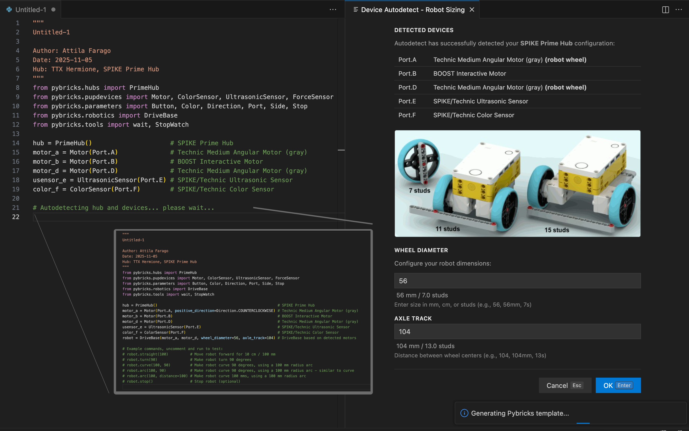
